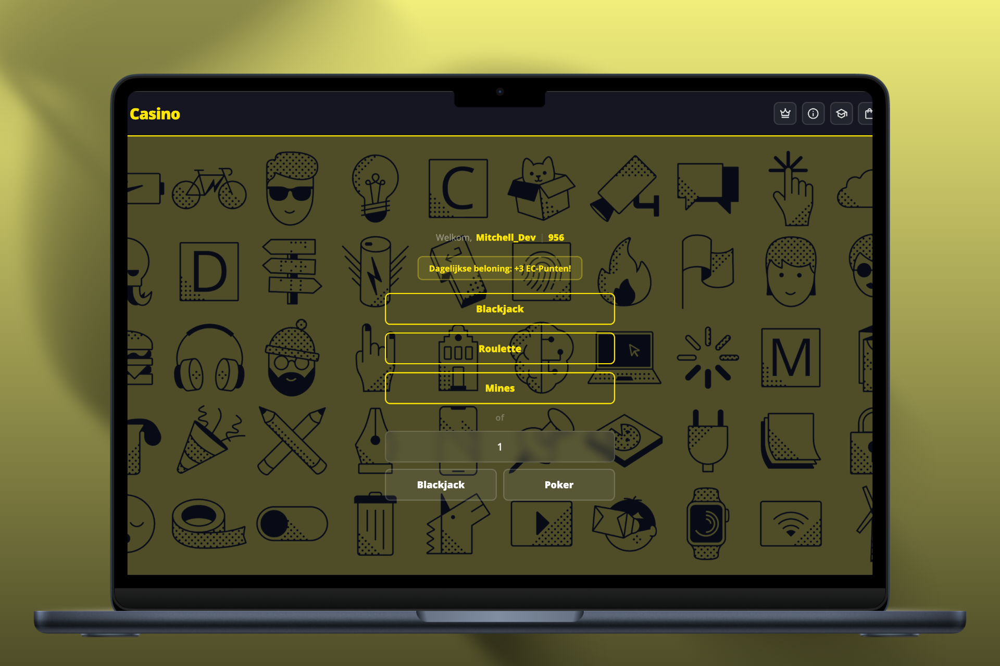

# Mitchell Scholte — Portfolio (v3)

A cinematic, fully responsive personal portfolio for **Mitchell Scholte**, a full-stack
developer from Amsterdam. Built from scratch in **vanilla JavaScript** (no framework),
with a WebGL background, an interactive terminal, a 3D globe, bilingual content (EN/NL)
and a deep accessibility panel.

> **Live:** _add your deployed URL here_



---

## ✨ Highlights

- **Cinematic WebGL background** — animated shader canvas with vignette, spotlight,
  scanlines and film-grain overlays ([cinematic.js](cinematic.js)).
- **Interactive terminal** — a separate text-adventure page where visitors explore my
  skills, projects and contact info by typing commands (try `help`). Includes a few
  easter eggs ([terminal.html](terminal.html), [terminal.js](terminal.js)).
- **3D wireframe globe** — drag-to-spin globe built with Three.js ([globe.js](globe.js)).
- **Project carousel + case studies** — an animated slider on the homepage
  ([project-carousel.js](project-carousel.js)) linking to full case-study pages
  ([project-structure.html](project-structure.html)).
- **Bilingual (EN / NL)** — every string is translated and swaps live without reload
  ([i18n.js](i18n.js)).
- **Accessibility panel** — 11 toggles: reduce motion, high contrast, larger text,
  dyslexia-friendly font, wider spacing, reduced color, stronger focus, and more.
- **Custom cursor, scroll reveals & parallax** — GSAP + ScrollTrigger driven
  ([effects.js](effects.js), [script.js](script.js)).
- **Working contact form** — EmailJS + Google reCAPTCHA ([emailjs-contact.js](emailjs-contact.js)).
- **Skill radar charts**, animated timeline, certificate viewer and a tools/language marquee.

---

## 🛠 Tech stack

| Area            | Tech                                                        |
| --------------- | ----------------------------------------------------------- |
| Core            | HTML5, CSS3, vanilla JavaScript (ES6+)                       |
| Animation       | [GSAP](https://gsap.com/) 3.12 + ScrollTrigger              |
| 3D / WebGL      | [Three.js](https://threejs.org/) r128                       |
| Forms           | [EmailJS](https://www.emailjs.com/) + Google reCAPTCHA      |
| Fonts           | Outfit, Atkinson Hyperlegible (Google Fonts)                |
| Tooling         | No build step — static files, deploy anywhere               |

No bundler, no framework, no `node_modules` — it runs as plain static files.

---

## 📁 Project structure

```
portfolioV3/
├── index.html              # Main single-page site
├── terminal.html           # Interactive terminal page
├── blog.html               # Blog (list + single-post via ?slug=)
├── cmd-casino.html         # Case-study shell (data-case="cmd-casino")
├── hcd.html                # Case-study shell (data-case="hcd")
├── project-structure.html  # Lightweight case-study template (reads ?id=)
│
├── script.js               # Core UI: nav, theme, skills toggle, radars, mobile menu
├── effects.js              # Cursor, scroll reveals, parallax, project float images
├── cinematic.js            # WebGL background + overlays
├── globe.js                # Three.js 3D globe
├── project-carousel.js     # Homepage project slider + data
├── case-study.js           # Bilingual case-study content + renderer (EN/NL)
├── project-structure.js    # Lightweight case-study content (per-project data)
├── blog.js                 # Blog posts data + render logic (EN/NL)
├── terminal.js             # Terminal commands + easter eggs
├── i18n.js                 # EN / NL translations
├── emailjs-contact.js      # Contact form handling
│
├── styles.css              # Main stylesheet
├── premium.css             # Polish / premium effects layer
├── project-carousel.css    # Project slider styles
├── blog.css                # Blog list + article + homepage teaser
├── case-study.css          # Case-study page styling
├── styles-project.css      # Lightweight case-study template styles
├── terminal.css            # Terminal styles
│
├── img/                    # Logos, tool/language icons, CV PDF
├── project-images/         # Project carousel thumbnails
└── img-projects/           # Per-project case-study screenshots
    └── cmd-casino/         # CMD Casino case-study images
```

---

## 🚀 Run locally

It's a static site, so any local server works. From the project root:

```bash
# Option 1 — Python
python -m http.server 5500

# Option 2 — Node (npx, no install)
npx serve .

# Option 3 — VS Code "Live Server" extension → Open index.html → Go Live
```

Then open <http://localhost:5500>.

> Opening `index.html` directly via `file://` mostly works, but a local server is
> recommended so fonts, the contact form and relative paths behave correctly.

### Configuration

The contact form uses EmailJS and reCAPTCHA. To make it send from your own account,
replace the public keys in [index.html](index.html) (`emailjs.init(...)` and the
`data-sitekey`) and the service/template IDs in [emailjs-contact.js](emailjs-contact.js).

---

## ➕ Adding a project case study

There are two routes:

- **Full case study (recommended for flagship projects).** These are **bilingual
  (EN/NL)** and data-driven. Add an entry to the `CASE_STUDIES` object in
  [case-study.js](case-study.js) keyed by an id, with `en`/`nl` content and a list of
  typed sections (`prose`, `cards`, `tech`, `highlights`, `compare`, `research`,
  `timeline`, `checklist`, `cta`). Code snippets are arrays of lines (rendered safely
  via `textContent`). Then create a thin shell page (copy [hcd.html](hcd.html)) whose
  `<main id="cs-root" data-case="<id>">` selects the content, put screenshots under
  `img-projects/<id>/`, and point the project's `url` in
  [project-carousel.js](project-carousel.js) at the page. Styled by
  [case-study.css](case-study.css). Live examples: [cmd-casino.html](cmd-casino.html),
  [hcd.html](hcd.html).
- **Lightweight case study.** Add an entry to the `projects` array in
  [project-structure.js](project-structure.js) (unique `id`, `title`, `keywords`,
  `details`, `image`, `attention`, `description`) and link to it with
  `project-structure.html?id=<your-id>`.

## ✍️ Adding a blog post

Edit the `POSTS` array at the top of [blog.js](blog.js). Each post has a unique
`slug`, a `date`, `tags`, an optional `cover` image, and bilingual `title` / `excerpt`
/ `body` (`{ en, nl }`). Posts render automatically; open one at
`blog.html?slug=<slug>`.

---

## ♿ Accessibility & i18n

- All interactive controls are keyboard reachable, with a skip-link and ARIA labels.
- The accessibility panel persists preferences in `localStorage`.
- Respects `prefers-reduced-motion` and ships a reduced-motion fallback for the projects
  grid.
- Language preference (EN/NL) is stored and restored on the next visit.

---

## 📬 Contact

- **Portfolio:** _add your deployed URL_
- **GitHub:** [@MitchellKevin](https://github.com/MitchellKevin)
- **LinkedIn:** [Mitchell Scholte](https://www.linkedin.com/in/mitchell-scholte-a10652238/)
- **Email:** mitchell.scholte04@gmail.com

---

© 2025 Mitchell Scholte. All rights reserved.
